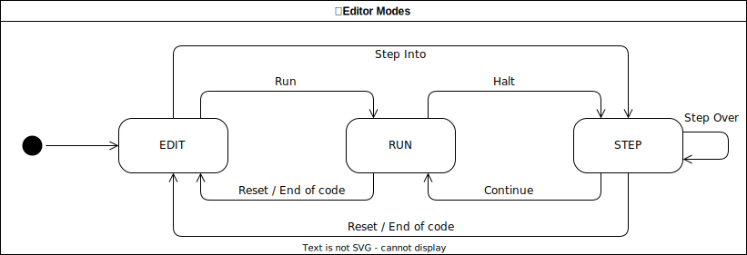

# Editor Modes

Currently there are three modes the editor can be in:
* EDIT Mode:
  * Users are able to enter new code or edit existing code. This is also the initial state whenever the application is opened or refreshed.
  * With the run button the current code is loaded onto the board and executed in RUN mode.
  * With the step button the current code is loaded onto the board and halted on the first insturction in STEP mode.
* RUN Mode:
  * The currently compiled code is being executed. In this state, edits to the code are not possible to prevent the displayed code in the editor to be out of sync with whats actually loaded onto the CT board.
  * With the reset button the board will be reset and the editor is moved into EDIT mode.
  * With the halt button the execution is halted and the editor moves into STEP mode.
* STEP Mode:
  * The currently compiled code execution is haltet at a certain point. As in RUN Mode, edits to the code are also not possible.
  * With the reset button the board will be reset and the editor is moved into EDIT mode.
  * With the step button the next instruction can be executed. The editor will stay in STEP mode.
  * With the continue button the execution can be continued in RUN mode.

Below is a state diagram that visualizes the three modes:

