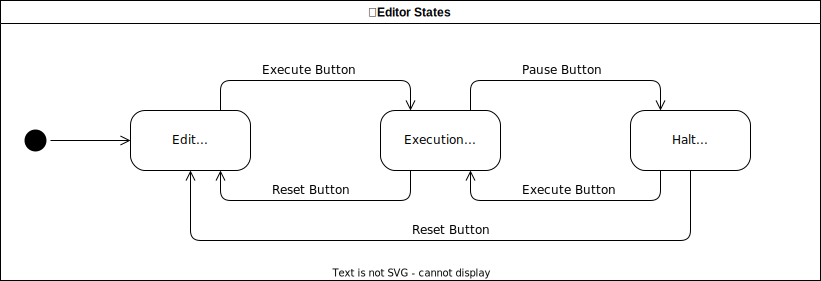

# Editor States

Currently there are three states the editor can be in:
* Edit Mode:
  * Users are able to enter new code or edit existing code. This is also the initial state whenever the application is opened or refreshed.
* Run Mode:
  * The currently compiled code is being executed. In this state, edits to the code are not possible to prevent the displayed code in the editor to be out of sync with whats actually loaded onto the CT board.
* Halt Mode:
  * The currently compiled code execution is haltet at a certain point.

Below is a state diagram that visualizes the three states:

